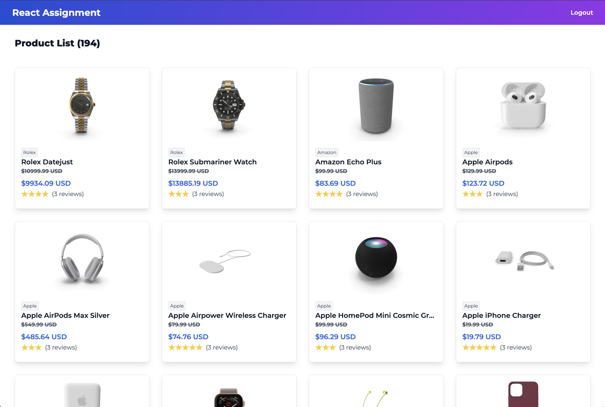
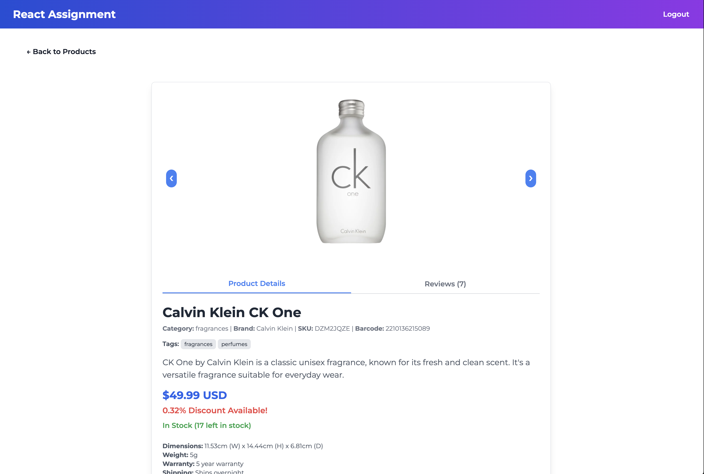

# React + TypeScript + Vite Project

This is a simple E-Commerce React project that uses TypeScript and Vite. It fetches products from a fake API and displays them in a grid. You can go to the product detail page by clicking on a product.

1. **Clone the repository:**

```sh
git clone https://github.com/mertmcd/react-assignment.git
cd react-assignment
```

2. **Install dependencies:**

```sh
npm install
```

## Running the Project

1. **Start the development server:**

```sh
npm run dev
```

2. **Open your browser and navigate to:**

```
http://localhost:5173
```

## Run Tests

```sh
npm test
```

## Technologies Used

- React
- TypeScript
- Vite
- Redux Toolkit
- React Router
- Axios
- Jest
- React Testing Library

## Project Structure

- `src/` - Source code directory

  - `components/` - React components directory
  - `pages/` - React pages directory
  - `types/` - TypeScript types directory
  - `store/` - Redux store directory
  - `api/` - API directory
  - `contexts/` - React contexts directory
  - `features/` - Redux Slice directory
  - `helpers/` - Helper functions directory

- `public/` - Public assets directory
- `vite.config.ts` - Vite configuration file
- `tsconfig.json` - TypeScript configuration file
- `package.json` - NPM package configuration file

## Screenshots

# Product Listing Page



# Product Detail Page


